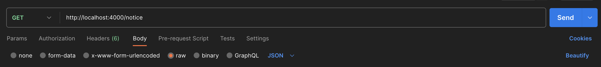
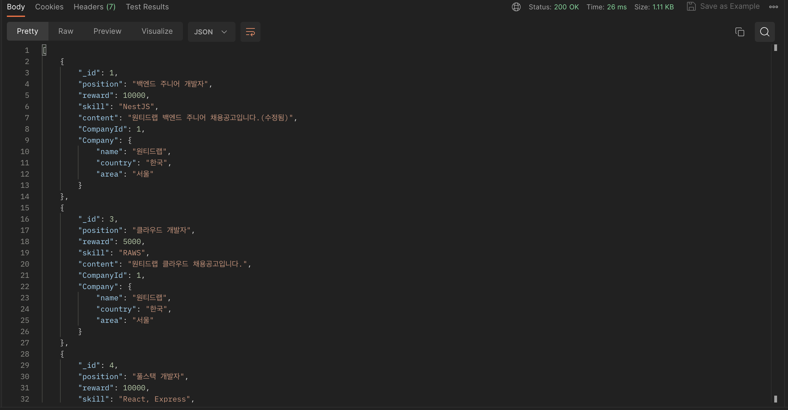
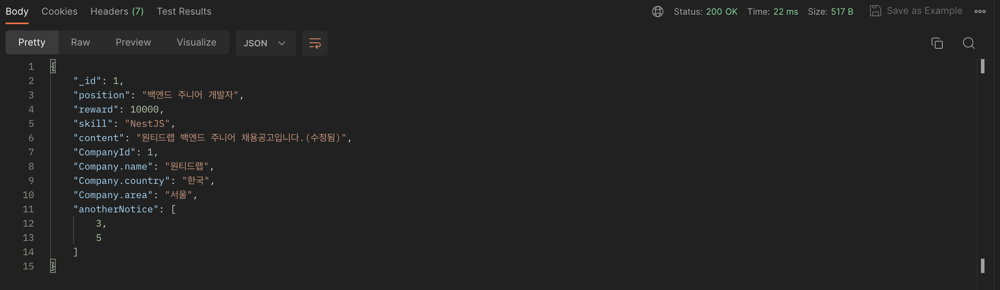

# wanted-pre-onboarding-backend
> 프리온보딩 백엔드 인턴십 선발과제

## 사용 기술


## 실행 방법

파일 root경로 접속 후 같은 레벨에 .env 생성해 환경변수 설정
```
MYSQL_USERNAME= {default:root}
MYSQL_PASSWORD= {default:wanted1234}
MYSQL_DATABASE= {default:wanted_db}
MYSQL_HOST= wanted_db_container //변경시 compose-yml의 db 컨테이너 이름 동일하게 변경
MYSQL_PORT= {default:3307}
SERVER_PORT= {default:4000}
```

root경로 레벨에서 다음 명령어 실행
```sh
docker-compose build
docker-compose up -d
```

## DB_ERD


## 사전 준비 사항
### 1. 사용자 등록.

```
[Post] http://localhost:4000/user/ 

body:

{
    "name" : "김철수"
}
```


### 2. 회사 등록.
```
[Post] http://localhost:4000/company/ 

body:

{
    "name" : "원티드랩",
    "country" : "한국",
    "area" : "서울"
}
```


## 요구 사항

### 1. 채용공고를 등록합니다.
Request
```
[Post] http://localhost:4000/notice 

body:

{
    "position" : "백엔드 개발자",
    "reward" : "5000",
    "skill" : "Express",
    "content" : "원티드 백엔드 개발자 채용공고입니다.",
    "companyId" : 1 //회사 id
}
```


Response


### 2. 채용공고를 수정합니다.

Request (Path Variable:채용 공고 id)
```
[Patch] http://localhost:4000/notice/:id

body:

{
    "position" : "백엔드 주니어 개발자",
    "reward" : "5000",
    "skill" : "Express",
    "content" : "원티드랩 백엔드 주니어 채용공고입니다.(수정됨)",
}
```


Response


### 3. 채용공고를 삭제합니다.

Request (Path Variable:채용 공고 id)
```
[Delete] http://localhost:4000/notice/:id
```


### 4-1. 채용공고를 목록을 가져옵니다.

Request
```
[Get] http://localhost:4000/notice/
```


Response


### 4-2. 채용공고를 검색해 목록을 가져옵니다.

Request Request (Query String=tag:검색어)
```
[Get] http://localhost:4000/notice/find?tag=원티드
```


Response


### 5. 채용 상세 페이지를 가져옵니다.

Request (Path Variable:채용 공고 id)
```
[Get] http://localhost:4000/notice/:id
```


Response


### 6. 사용자는 채용공고에 지원합니다.

Request (Path Variable:채용 공고 id)
```
[Post] http://localhost:4000/applicant/:id

body:

{
     "userId" : 1
}
```


Response


## 요구사항 개발 구현
1. 채용공고를 등록합니다. ✅
2. 채용공고를 수정합니다. ✅
3. 채용공고를 삭제합니다. ✅
4. 채용공고 검색 
4-1. 채용공고 목록을 가져옵니다. ✅
4-2. 채용공고 검색 기능 구현(선택사항 및 가산점요소). ✅
5. 채용 상세 페이지를 가져옵니다.
5-1. “채용내용”이 추가적으로 담겨있음. ✅
5-2. 해당 회사가 올린 다른 채용공고 가 추가적으로 포함됩니다(선택사항 및 가산점요소). ✅
6. 사용자는 채용공고에 지원합니다(선택사항 및 가산점요소)(1회만 지원 가능). ✅
7. Unit Test 구현
8. README 에 요구사항 분석 및 구현 과정을 작성 ✅
9. Git commit 메시지 컨벤션 ✅